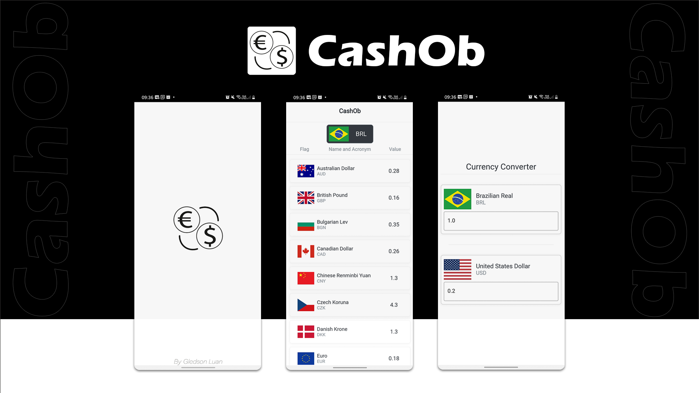

 

## Sobre o App 📱

<h3 align="center">
CashOb ë um observador e conversor de moedas que extrai dados do Banco Central Europeu através de uma api open source.
</h3>

## Algumas especificações 📝
* Requisições HTTP para consumo de API REST
* Armazenamento de dados com SQLITE
* Criação de Splash Screen
* Utilização de controllers
* Injeção de Dependência
* Gerenciamento de Estado no Flutter

## Recursos📚
* FrankfurtAPI: https://www.frankfurter.app/
* Flutter: https://flutter.dev/

## **Autor - Gledson Luan**🚀
- Linkedin: [@gledsonluan](https://www.linkedin.com/in/gledsonluan/)
- Github: [@GledsonLScruz](https://github.com/GledsonLScruz)

